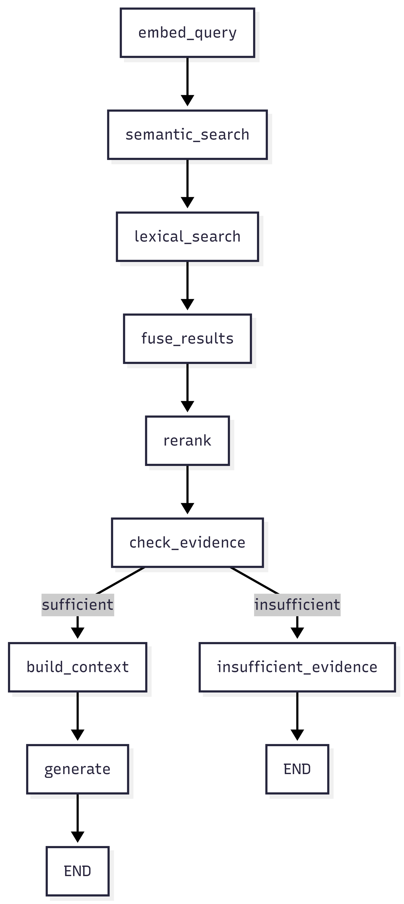

# Luma

Evidence-based AI for your documents.

Luma is a document intelligence platform that lets you upload documents, ask natural language questions, and get answers grounded in the original sources with inline citations. It uses a full RAG (Retrieval-Augmented Generation) pipeline built with **LangChain** and **LangGraph**, featuring hybrid search, cross-encoder reranking, and configurable LLM generation via OpenRouter.

---

## How It Works


1. **Ingestion** — Documents are parsed (page-aware for PDFs), split into overlapping chunks, embedded with sentence-transformers, and stored in both a Qdrant vector index and an in-memory BM25 index.
2. **Retrieval** — Queries run through hybrid retrieval (semantic + BM25), fused with weighted Reciprocal Rank Fusion (RRF), and reranked with a cross-encoder.
3. **Generation** — The top evidence is passed to an LLM which generates an answer with numbered citations pointing to the source document and page.

The entire retrieval-to-generation flow is orchestrated as a **LangGraph state graph**:



---

## Tech Stack

| Layer | Technology |
|-------|-----------|
| Backend | FastAPI, Python 3.11+, Pydantic, uvicorn |
| AI/ML Orchestration | LangChain, LangGraph |
| Frontend | Next.js 16, React 19, TypeScript, Tailwind CSS 4, Motion |
| Embeddings | sentence-transformers (`all-MiniLM-L6-v2`, 384d) |
| Reranking | Cross-encoder (`ms-marco-MiniLM-L-6-v2`) |
| Vector DB | Qdrant (in-memory or server) |
| Lexical Search | BM25 (`rank-bm25`) |
| LLM | OpenRouter (any model — free models supported) |
| Doc Parsing | pypdf, python-docx |
| Logging | structlog |
| Build System | hatchling, npm |

---

## Getting Started

### Prerequisites

- Python 3.11+
- Node.js 18+
- OpenRouter API key ([get one free](https://openrouter.ai/keys))
- Qdrant instance (optional — defaults to in-memory mode)

### Setup

```bash
# Clone
git clone https://github.com/<your-username>/luma.git
cd luma

# Backend
uv sync              # or: pip install -e ".[dev]"
cp .env.example .env # Edit with your keys

# Frontend
cd frontend
npm install
```

### Environment Variables

Create a `.env` file in the project root (copy from `.env.example`):

```env
# Required
OPENROUTER_API_KEY=sk-or-v1-...

# Qdrant — use ":memory:" for dev (no server needed, data lost on restart)
#        — use "http://localhost:6333" for persistent storage
QDRANT_URL=:memory:

# Optional: Hugging Face token for higher rate limits on model downloads
HF_API_TOKEN=hf_...
```

#### Full Configuration Reference

| Variable | Default | Description |
|----------|---------|-------------|
| `APP_ENV` | `development` | Environment (`development`, `staging`, `production`) |
| `APP_DEBUG` | `True` | Enable debug mode |
| `APP_HOST` | `0.0.0.0` | Server bind address |
| `APP_PORT` | `8000` | Server port |
| `OPENROUTER_API_KEY` | — | OpenRouter API key (required for LLM) |
| `HF_API_TOKEN` | — | Hugging Face token (optional) |
| `EMBEDDING_MODEL` | `sentence-transformers/all-MiniLM-L6-v2` | Embedding model |
| `EMBEDDING_DIMENSION` | `384` | Embedding vector dimensionality |
| `LLM_MODEL` | `meta-llama/llama-3.1-8b-instruct` | Default LLM model |
| `LLM_MAX_TOKENS` | `1024` | Max generation tokens |
| `LLM_TEMPERATURE` | `0.1` | Sampling temperature |
| `QDRANT_URL` | `:memory:` | Qdrant connection URL |
| `QDRANT_API_KEY` | — | Qdrant API key (if using cloud) |
| `QDRANT_COLLECTION_NAME` | `luma_documents` | Qdrant collection name |
| `RETRIEVAL_TOP_K` | `10` | Candidates retrieved before reranking |
| `RERANK_TOP_K` | `5` | Results after reranking |
| `CHUNK_SIZE` | `512` | Chunk size in characters |
| `CHUNK_OVERLAP` | `64` | Overlap between chunks |
| `UPLOAD_DIR` | `./uploads` | File upload directory |
| `MAX_UPLOAD_SIZE_MB` | `50` | Max upload file size |

### Run

```bash
# Terminal 1: Backend
uv run uvicorn backend.main:app --reload

# Terminal 2: Frontend
cd frontend
npm run dev
```

The frontend runs on `http://localhost:3000` and proxies `/api/*` requests to the backend at `http://localhost:8000`.

---

## API Endpoints

| Method | Path | Description |
|--------|------|-------------|
| `GET` | `/health` | Health check |
| `POST` | `/api/v1/documents` | Upload a document (multipart form) |
| `GET` | `/api/v1/documents` | List all documents |
| `GET` | `/api/v1/documents/{id}` | Get document details |
| `DELETE` | `/api/v1/documents/{id}` | Delete a document |
| `POST` | `/api/v1/chat` | Query documents (returns answer + citations) |
| `POST` | `/api/v1/chat/stream` | Query with SSE streaming |
| `GET` | `/api/v1/chat/models` | List available OpenRouter models |

---

## Project Structure

```
├── backend/
│   ├── main.py              # Uvicorn entry point
│   ├── api/                 # FastAPI app factory, routers, dependencies
│   ├── core/                # Config, exceptions, logging, DI container
│   ├── generation/          # LLM client, LangGraph RAG pipeline, prompts
│   ├── ingestion/           # Document parser, text chunker, embedder
│   ├── models/              # Pydantic schemas (documents, chunks, queries)
│   ├── repository/          # Qdrant vector store, document file storage
│   ├── retrieval/           # BM25 search, hybrid RRF fusion, cross-encoder reranker
│   └── services/            # Document and chat orchestration services
├── frontend/
│   └── src/
│       ├── app/             # Next.js pages (home, chat, documents)
│       ├── components/      # UI components (upload, cards, navigation)
│       ├── hooks/           # Document processing state hook
│       └── lib/             # Typed API client
├── pyproject.toml           # Python dependencies and tooling
└── .env.example             # Environment variable template
```

---

## Architecture

The backend uses a **dependency injection container** (`backend/core/container.py`) that lazily initializes all components. Key design decisions:

- **LangGraph for orchestration** — The RAG pipeline is a compiled state graph, giving clear node boundaries for observability, testing, and future branching (e.g., query routing, multi-hop retrieval).
- **Hybrid retrieval** — Combines dense vector search (semantic similarity) with sparse BM25 (keyword matching) via weighted RRF (default: 0.6 semantic, 0.4 lexical).
- **Evidence gating** — If no evidence scores above a minimum threshold after reranking, the system returns an "insufficient evidence" response rather than hallucinating.
- **Background processing** — Document ingestion (parse → chunk → embed → index) runs in a thread pool executor to avoid blocking the async event loop.
- **In-memory mode** — The default Qdrant URL is `:memory:`, meaning no external database is needed for development. Switch to a Qdrant server URL for persistence.

---

## Supported File Types

- PDF (page-aware parsing)
- DOCX
- TXT
- Markdown
- CSV

---

## Model Selection

The chat interface lets you choose from any model available on OpenRouter before sending a query. Free models are listed first. The selected model is used for that query (the default is `meta-llama/llama-3.1-8b-instruct`).

---

## Development

```bash
# Lint
uv run ruff check backend/

# Format
uv run ruff format backend/

# Type check
uv run mypy backend/

# Tests
uv run pytest

# Frontend build check
cd frontend && npm run build
```

---

## License

MIT
